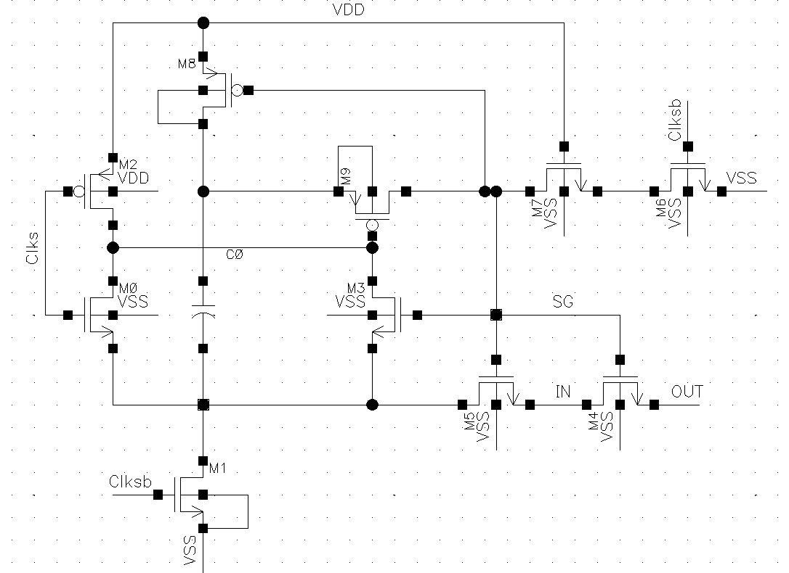
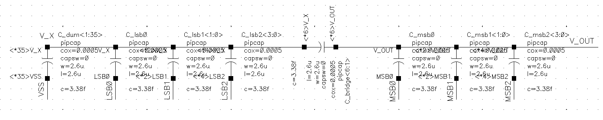
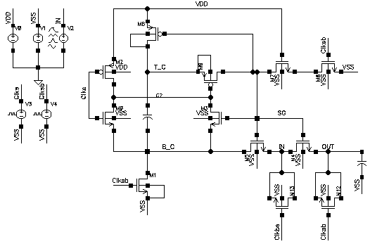

# SAR-ADC

**English** | [한국어](README.ko.md)

---

**SAR ADC C-DAC & Bootstrapped-Switch design on Cadence Virtuoso**

---

> ⚠️ **This repository is an IP-stripped (foundry-confidential-free) version.**
> All foundry PDK confidential assets — process technology files (`.tf`), display resources (`.drf`), Calibre cellmaps, SPICE models (`.scs`), and DRC/LVS/PEX rule decks — plus raw simulation output are removed.
> Only the **schematics, symbols, and testbenches designed here (OpenAccess `.oa`)** are included; foundry devices are referenced **by name only**.
> Without a PDK it will **not re-open as-is in Cadence** — this is an **archive / portfolio** snapshot.

---

## 1. Background

A SAR (Successive Approximation Register) ADC converts an input by repeating one analog trial per bit: sample the input, compare it against a DAC reference, and refine the DAC code bit-by-bit. It needs only a comparator, a capacitive DAC, and SAR logic — no per-stage amplifiers — which is why it dominates low-power, medium-resolution data conversion. Two analog blocks set the achievable accuracy, and this project designs both.

- **Sampling switch**: a plain MOS switch has signal-dependent on-resistance, which injects harmonic distortion during tracking. A **bootstrapped switch** holds V_GS ≈ V_DD constant across the input swing, keeping R_on nearly constant → high sampling linearity (ENOB ↑).
- **Capacitor DAC (C-DAC)**: sets the reference level for each bit trial by charge redistribution; matching and total capacitance trade against area/power. A **split (bridge-capacitor) array** shrinks the total-to-unit capacitance ratio for the same resolution.
- Everything is designed and simulated at the **schematic level** in Cadence Virtuoso; a dynamic comparator and a 2-stage op-amp are implemented alongside.

---

## 2. System Overview

```
 Vin ─►[ Sampling switch ]─►[   C-DAC   ]─►[ Comparator ]─► bit decision
         Bootstrap / TG        Conv/Split      Dynamic          │
              ▲                                                  │
              └────────── DAC code feedback (SAR logic*) ────────┘
                          * digital SAR logic is out of this repo's scope
```

| Component                          | Role                                                                         |
| ---------------------------------- | ---------------------------------------------------------------------------- |
| Sampling switch (Bootstrap / TG)   | Track-and-hold of Vin onto the C-DAC top plate with near-constant R_on       |
| C-DAC (Conv / Split / Diff-split)  | Binary-weighted charge-redistribution DAC — generates the per-bit reference |
| Dynamic comparator (`COMP`)      | Clocked latch comparing DAC output vs. common-mode at each bit trial         |
| 2-stage op-amp (`2stage_Op_amp`) | Reference / auxiliary amplifier (buffer, gain)                               |

> The digital SAR control logic (successive-approximation register) is **outside this repo's scope** — the focus is the analog front-end and DAC.

---

## 3. Circuit Architecture

### 3.1 Sampling front-end — Bootstrapped switch & TG



- **Bootstrapped switch** (`SWITCH/BSSW`) — Razavi topology: a boot capacitor C0 is charged to V_DD during the off-phase and stacked on the input during tracking so the sampling device sees a constant V_GS. Result: input-independent on-resistance and high linearity.
- **Transmission gate** (`SWITCH/TG`) — NMOS+PMOS parallel CMOS passgate, the baseline sampling switch for comparison *(merged from the legacy `CJH` library)*.

### 3.2 Charge-redistribution DAC — C-DAC



- **Conventional C-DAC** (`CDAC/CONV_CDAC`) — binary-weighted capacitor array.
- **Split C-DAC** (`CDAC/SPLIT_CDAC`) — a **bridge capacitor** splits the array into MSB/LSB sub-arrays, cutting total capacitance for the same resolution. **6-bit** (3-bit MSB + 3-bit LSB); unit capacitor **3.38 fF** pip-cap (2.6 µm × 2.6 µm).
- **Differential split C-DAC** (`CDAC/DIFF_SPLIT_CDAC`) — differential (V_op / V_on) version of the split array for improved PSRR/linearity.

### 3.3 Comparator & op-amp



- **Dynamic comparator** (`CDAC/COMP`) — clock-driven dynamic latch making one decision per bit trial.
- **2-stage op-amp** (`2stage_Op_amp`) — differential input stage + output stage, for reference/buffer duties.

**Design Spec**

| Item                     | Spec                                                                                            |
| ------------------------ | ----------------------------------------------------------------------------------------------- |
| Design tool              | Cadence Virtuoso (Schematic + ADE Spectre), OpenAccess DB                                       |
| Verification             | Spectre transient (ADE states), Calibre DRC / LVS / PEX runsets                                 |
| Process (reference only) | ETRI/NSPL 0.5 µm Analog CMOS PDK (design lib); HL18G 0.18 µm, TSMC 0.18 µm setups            |
| C-DAC resolution         | 6-bit split (3-bit MSB + 3-bit LSB via bridge capacitor)                                        |
| Unit capacitor           | 3.38 fF pip-cap (2.6 µm × 2.6 µm)                                                            |
| Sampling switch          | Bootstrapped (Razavi) + CMOS transmission gate                                                  |
| Key metrics              | Switch on-resistance (`TB_R_ON`), sampling linearity / ENOB (`TB_BSSW_2`, `TB_DIFF_BSSW`) |
| Design level             | Schematic + symbol + testbench (no layout / GDS)                                                |

**Cell Map** (`design/ETRI/`)

| Group            | Cells                                                                                                                                                    |
| ---------------- | -------------------------------------------------------------------------------------------------------------------------------------------------------- |
| Sampling switch  | `SWITCH/BSSW` (bootstrapped), `SWITCH/TG` (transmission gate)                                                                                        |
| C-DAC            | `CDAC/CONV_CDAC`, `CDAC/SPLIT_CDAC`, `CDAC/DIFF_SPLIT_CDAC`                                                                                        |
| Comparator / amp | `CDAC/COMP` (dynamic comparator), `2stage_Op_amp`                                                                                                    |
| Testbenches      | `TB_BSSW`, `TB_BSSW_2`, `TB_DIFF_BSSW`, `TB_R_ON`, `TB_TG`, `TB_CONV_CDAC_2`, `TB_SPLIT_CDAC`, `TB_SPLIT_CDAC_2`, `TB_DIFF_SPLIT_CDAC` |

---

## 4. Directory Structure

```
SAR-ADC/
├── design/                          # Cadence Virtuoso design (OpenAccess)
│   ├── cds.lib / .cdsinit / .cshrc / .libmgr   # library & environment setup
│   ├── calview.cellmap                          # Calibre view mapping (analogLib)
│   ├── DRC_runset / LVS_runset / PEX_runset     # physical-verification runsets
│   ├── ETRI/                        # design libraries
│   │   ├── 2stage_Op_amp/           #   2-stage op-amp
│   │   ├── CDAC/                    #   capacitor DAC + comparator
│   │   │   ├── COMP/                #     dynamic comparator
│   │   │   ├── CONV_CDAC/           #     conventional C-DAC
│   │   │   ├── SPLIT_CDAC/          #     split C-DAC
│   │   │   ├── DIFF_SPLIT_CDAC/     #     differential split C-DAC
│   │   │   └── TB_*/                #     testbenches (Spectre states)
│   │   └── SWITCH/                  #   sampling switch
│   │       ├── BSSW/                #     bootstrapped switch
│   │       ├── TG/                  #     transmission gate (merged from CJH)
│   │       └── TB_*/                #     testbenches (Spectre states)
│   └── TSMC180nm/                   # TSMC 0.18 µm library setup (path reference only)
│
└── documents/
    ├── figures/                     # block schematics (fig1~6)
    ├── papers/                      # reference paper · design report
    └── Presentation/                # slides · poster (PPTX)
```

---

## 5. Getting Started

> ⚠️ This is an **IP-stripped archive**: no PDK, models, or rule decks are included, so cells do **not** re-open device-complete in Cadence. The steps below assume you supply a compatible PDK locally.

### Requirements

- Cadence Virtuoso (IC6.1.8 / ICADV) with the Spectre simulator
- A compatible CMOS PDK — NSPL 0.5 µm Analog CMOS (design library), or HL18G / TSMC 0.18 µm (**not** included)
- Calibre (optional) for DRC / LVS / PEX

### Library setup

```tcl
# design/ETRI/cds.lib — point the DEFINE lines at your local path,
# and INCLUDE your PDK's cds.lib
INCLUDE <your-pdk>/cds.lib
DEFINE  CDAC    <path>/ETRI/CDAC
DEFINE  SWITCH  <path>/ETRI/SWITCH
```

```bash
cd design
virtuoso &          # launch the Library Manager
```

### Simulation (ADE Spectre)

1. Open a `TB_*` cell's `schematic` view.
2. Launch **ADE** → *Session ▸ Load State* → pick a saved `spectre_state*`.
3. *Netlist and Run*. ENOB / on-resistance outputs are pre-configured in the saved states
   (`SWITCH/TB_BSSW_2`, `SWITCH/TB_DIFF_BSSW` include ENOB waveform setups; `SWITCH/TB_R_ON` measures on-resistance).

### Physical verification (Calibre)

`design/DRC_runset` / `LVS_runset` / `PEX_runset` are Calibre runset templates — repoint their rule-deck and layout paths to your environment before running. *(Layout / GDS is not part of this archive.)*

---

## 6. Development Status

**Current state — schematic-level design & simulation complete.** All core analog blocks (bootstrapped switch, transmission gate, dynamic comparator, conventional / split / differential-split C-DAC, 2-stage op-amp) are designed at schematic level with per-block Spectre testbenches. Sampling linearity (ENOB) and switch on-resistance analyses are set up in ADE. Physical layout / GDS is out of scope.

### Sampling switch

- [X] Bootstrapped switch (`SWITCH/BSSW`) — Razavi topology, schematic + symbol
- [X] Transmission gate (`SWITCH/TG`) — CMOS passgate (merged from legacy `CJH` library)
- [X] `TB_R_ON` — on-resistance measurement
- [X] `TB_BSSW` / `TB_BSSW_2` / `TB_DIFF_BSSW` — ENOB / linearity sweeps (single + differential)
- [X] `TB_TG` — transmission-gate testbench

### C-DAC

- [X] `CONV_CDAC` — binary-weighted array (schematic + symbol)
- [X] `SPLIT_CDAC` — 6-bit bridge-cap split array, 3.38 fF unit pip-cap
- [X] `DIFF_SPLIT_CDAC` — differential split array (V_op / V_on)
- [X] `TB_CONV_CDAC_2` / `TB_SPLIT_CDAC` / `TB_SPLIT_CDAC_2` / `TB_DIFF_SPLIT_CDAC`

### Comparator & amplifier

- [X] `COMP` — clocked dynamic latch comparator
- [X] `2stage_Op_amp` — 2-stage op-amp (schematic + symbol)

### Documents

- [X] Block schematics captured (`documents/figures/` fig1~6)
- [X] Design report (`documents/papers/`)
- [X] Presentation slides + poster (`documents/Presentation/`)

### Out of scope

- [ ] Digital SAR control logic / register
- [ ] Physical layout, DRC/LVS-clean GDS, PEX back-annotation

---

## 7. Extras

### Documents

| Path                        | Contents                                                            |
| --------------------------- | ------------------------------------------------------------------- |
| `documents/figures/`      | Block schematics — bootstrapped switch, comparator, C-DAC (fig1~6) |
| `documents/papers/`       | Reference paper + design report (PDF)                               |
| `documents/Presentation/` | Presentation slides + poster (PPTX)                                 |

### Design notes

- **IP removed**: `.oa` cells retain only foundry device **names** (`nch`/`pch`, `nmos4`/`pmos4`, `pipcap`, …) and process identifiers — no model parameters, layout, or rule decks.
- **No layout / GDS**: this is a schematic + simulation archive only.
- **Cells named by function**, not by device numbering; the transmission gate was merged in from a legacy `CJH` library.
- **Three PDK setups** are referenced by path (`design/ETRI` → NSPL 0.5 µm, `design/cds.lib` → HL18G 0.18 µm, `design/TSMC180nm` → TSMC 0.18 µm); the active design library is `ETRI/`.

---

## 8. References

- B. Razavi, *"The Design of a Bootstrapped Switch Circuit,"* IEEE Solid-State Circuits Magazine — bootstrapped-switch reference *(`documents/papers/`, third-party, kept local only)*
- *"SAR ADC용 C-DAC 및 Bootstrap Switch 설계"* — project design report *(`documents/papers/`)*
- Split / bridge-capacitor DAC and SAR ADC front-end design literature
